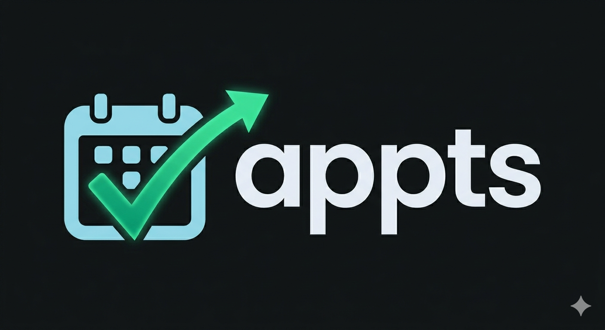

# Appts UK — Media

Public repository for media resources (logos, images, etc.) for [Appts UK](https://appts.uk) — an online booking and reservation system.

## Usage

All assets can be referenced via raw GitHub URLs. For example:

```
https://raw.githubusercontent.com/appts-uk/media/main/images/logos/logo.png
```

## Assets

| Preview | File | Description |
|---|---|---|
|  | [`images/logos/logo.png`](images/logos/logo.png) | Primary logo |
|  | [`images/logos/logo-dark.png`](images/logos/logo-dark.png) | Dark variant logo |
|  | [`images/logos/icon.png`](images/logos/icon.png) | App icon |
|  | [`images/logos/icon-dark.png`](images/logos/icon-dark.png) | Dark variant app icon |
